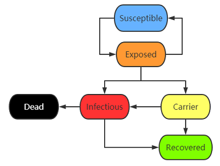

# COVID-19 Pandemic Model

## Group B
Tech lead: TBD

- Tian Ding
- Xiaoxin Gan
- Zhelin Liao
- Peiqing Lu
- Ziqi Tan
- Xueyan Xia
- Kaijia You

## Task Instructions
The purpose of this project is to build a working computer simulation of the COVID-19 pandemic using parallel programming.

- The results can easily be recognized as a representation of the workings of contagion, recovery, and death in the pandemic. The graph of new infections, for instance, should have a shape that resembles the curve produced by other standard simulations.

- The primary aim of this project is not to have an impressive performance or to have a simulation so realistic as to provide accurate numerical predictions, but rather to give you a good learning experience in the design of a simulation from scratch and its implementation by means of the standard parallel programming techniques we have learned in the course.

- The simulation should take into account social networks.  The social networks may be created randomly but should not wind up being completely connected graphs.

- Do not go shopping for ready-made, specialized libraries and software packages designed for the simulation of epidemics.  Instead, build your simulation and your implementation from the ground up.

## System Model

We are going to use **an agent-based network model** to simulate the process and outcome of the spread of the COVID-19. Our COVID-19 model is based on the SIR model (Susceptible, Infectious, Recovered), which will be briefly discussed first. Then 

### Basic SIR Model

- Susceptible: The number of susceptible individuals. 
- Infectious:
- Recovered: 

$$
\frac{dS(t)}{dt} = -\alpha S(t) I(t)
$$

$$
\frac{dI(t)}{dt} = \alpha S(t) I(t) - \beta I(t)
$$

$$
\frac{dR(t)}{dt} = \beta I(t)
$$

$$
0 < \alpha < 1 
$$

$$
0 < \beta < 1
$$

### COVID-19 Pandemic Model

We continue to integrate more factors into the basic SIR model to get our COVID-19 pandemic model.

#### Assumption

1. Total population size remains constant. 
2. The time scale is short so that births and deaths (other than deaths caused by the COVID 19) can be neglected.
3. Individuals who get recovered from COVID 19 will not get infected again.

#### Finite State Machine of an Agent

Individual has different state under such a pandemic. 

- Susceptible: an individual in a susceptible state is a member of a population who is at risk of becoming infected by a disease. 
- Exposed: an individual in the exposed state will get infected or become a virus carrier.

#### Variants of the agents

#### Events

## Simulation

### Parallel Computing Technology

## Collaboration

## Future work

## References

[1] Wikipedia, Compartmental models in epidemiology

[2] Katia Bulekova, Brian Gregor, Eric D. Kolaczyk, Wenrui Li, and Laura White, Github project BU-COVID, August 3, 2020.

[3] Systems Sciences at SIS, A networked SIR model, http://systems-sciences.uni-graz.at/etextbook/networks/sirnetwork.html
