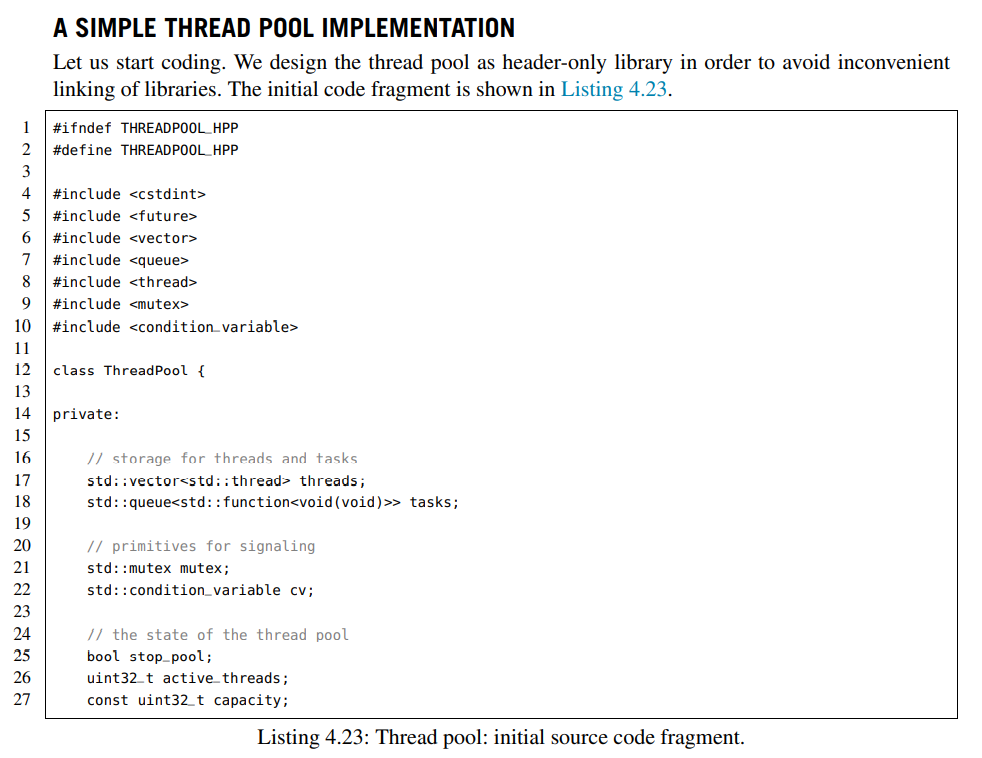

# C++ 线程池

https://wangpengcheng.github.io/2019/05/17/cplusplus_theadpool/

## Why thread pool

当进行并行的任务作业操作时，线程的建立与销毁的开销是，阻碍性能进步的关键，因此线程池，由此产生。使用多个线程，无限制循环等待队列，进行计算和操作。帮助快速降低和减少性能损耗。

## 线程池的组成
1. 线程池管理器：初始化和创建线程，启动和停止线程，调配任务；管理线程池。
2. 工作线程：线程池中等待并执行分配的任务。
3. 任务接口：添加任务的接口，以提供工作线程调度任务的执行。
4. 任务队列：用于存放没有处理的任务，提供一种缓冲机制，同时具有调度功能，高优先级的任务放在队列前面

